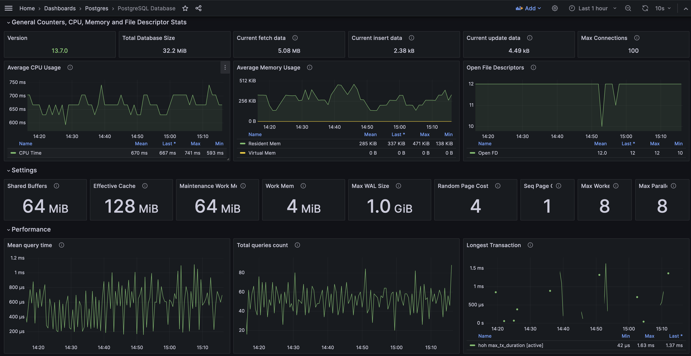

### Create a managed hub cluster (Developer Preview)
Refer to the original [Create cluster](https://access.redhat.com/documentation/en-us/red_hat_advanced_cluster_management_for_kubernetes/2.8/html/clusters/cluster_mce_overview#creating-a-cluster) document to create the managed cluster in the global hub cluster. Add the label of `global-hub.open-cluster-management.io/hub-cluster-install: ''` to the `managedcluster` custom resource and then the new created managed cluster can automatically be switched to be a managed hub cluster. In other words, the latest version of Red Hat Advanced Cluster Management for Kubernetes is installed in this managed cluster. You can get the Red Hat Advanced Cluster Management hub information in the cluster overview page.

### Enable Strimzi and Postgres Metrics
Collecting metrics is critical for understanding the health and performance of your Kafka deployment and postgres database. By monitoring metrics, you can actively identify issues before they become critical and make informed decisions about resource allocation and capacity planning. Without metrics, you may be left with limited visibility into the behavior of your Kafka deployment, which can make troubleshooting more difficult and time-consuming.

Globalhub set `enableMetrics: true` in the `spec` section by default.
After the kafka operator reconciling is completed, you can check the dashboards in global hub grafana. You will see the following dashboards under Strimzi folder:
- Global Hub - Strimzi Operator

- Global Hub - Strimzi Kafka

- Global Hub - Strimzi Zookeeper

The following dashboards will be in Postgres folder:
- Global Hub - PostgreSQL Database

